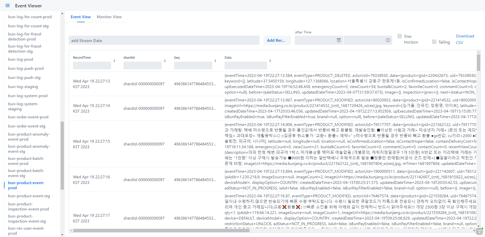

# kinesis-GUI

Amazon kinesis 의 이벤트를 추적하고 관련 기능을 제공하는 web application

## requirement

1. java 17 or higher

## deveploment requirement
1. java 17 or higher
2. Node.js 18 or higher
3. gradle 8.5 or higher
4. spring 3.0 or higher

## feature

1. 스트림 이벤트 tailing viewer
2. 새로운 이벤트 추가 
3. trim horizon, after time 이벤트 검색 
4. 이벤트 inner search
5. event csv 다운로드 
6. 스트림 metric viewer

## manual 

Please refer to the wiki page

https://github.com/yukyongsoo/kinesis-cli/wiki

## issue raise

we use github issue page 

https://github.com/yukyongsoo/kinesis-cli/issues

## Browser Compatibility

1. Chrome: Evergreen
2. Firefox: Evergreen, ESR
3. Safari: 15 or later
4. Edge: Evergreen, Chromium
